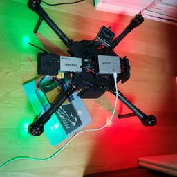
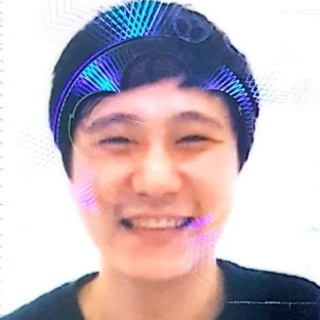
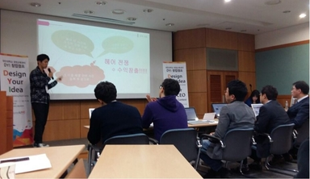
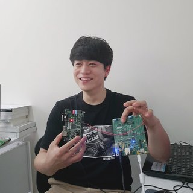
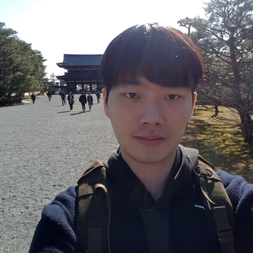
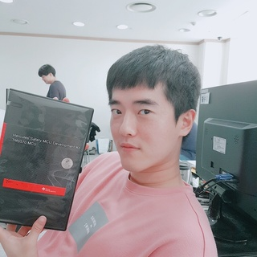
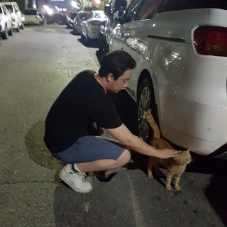
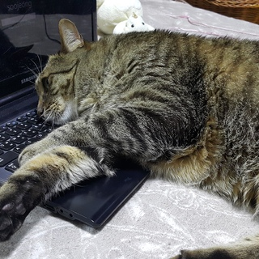
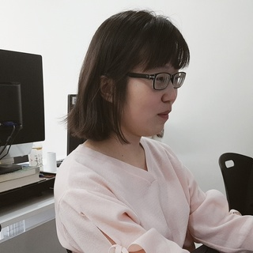
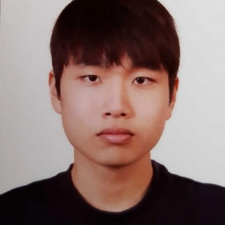

# RC_Car
Autonomous RC Car for Baby

|주제|제목|자료 링크|
|-|-|-|
||SMPS Power Electronics|[move to document](https://github.com/KOITT2/RC_Car/blob/6ed79b1c4e26541f60f777e2353fc5d0c711501d/circuit/dcdc/Switch-Mode%20Power%20Supplies.pdf)|

|캡션1|캡션2|캡션3|
|-|-|-|
|행1|셀|셀|
|행2|셀|셀

```c
#include <stdio.h>

int main(void)
{
  return 0;
}
```

# Master
- Sanghoon Lee:			gcccompil3r@gmail.com



|Subject|Title|Link|
|-|-|-|
|Power Electronics|LC Resonance|[pdf](https://github.com/KOITT2/RC_Car/blob/master/circuit/dcdc/LC%20Resonance.pdf)|
|Power Electronics|SMPS Power Electronics 1|[pdf](https://github.com/KOITT2/RC_Car/blob/master/circuit/dcdc/SMPS_PowerElectronics_1.pdf)|
|Power Electronics|SMPS Power Electronics 5|[pdf](https://github.com/KOITT2/RC_Car/blob/master/circuit/dcdc/SMPS_PowerElectronics_5.pdf)|
|Week Mission|1st Week Mission|[pdf](https://github.com/KOITT2/RC_Car/blob/master/cur_present/%EC%B4%9D%EA%B4%84%EC%84%A4%EA%B3%84%EC%A0%90%EA%B2%80/Project_1.pdf)|
|Week Mission|2nd Week Mission|[pdf](https://github.com/KOITT2/RC_Car/blob/master/cur_present/%EC%B4%9D%EA%B4%84%EC%84%A4%EA%B3%84%EC%A0%90%EA%B2%80/Project_2.pdf)|
|Week Mission|3rd Week Mission|[pdf](https://github.com/KOITT2/RC_Car/blob/master/cur_present/%EC%B4%9D%EA%B4%84%EC%84%A4%EA%B3%84%EC%A0%90%EA%B2%80/Project_3.pdf)|
|Week Mission|4th Week Mission|[pdf](https://github.com/KOITT2/RC_Car/blob/master/cur_present/%EC%B4%9D%EA%B4%84%EC%84%A4%EA%B3%84%EC%A0%90%EA%B2%80/Project_4.pdf)|
|Week Mission|5th Week Mission|[pdf](https://github.com/KOITT2/RC_Car/blob/master/cur_present/%EC%B4%9D%EA%B4%84%EC%84%A4%EA%B3%84%EC%A0%90%EA%B2%80/Project_5.pdf)|
|Week Mission|6th Week Mission|[pdf](https://github.com/KOITT2/RC_Car/blob/master/cur_present/%EC%B4%9D%EA%B4%84%EC%84%A4%EA%B3%84%EC%A0%90%EA%B2%80/Project_6.pdf)|
|Design|Full Architecture|[pdf](https://github.com/KOITT2/RC_Car/blob/master/doc/design/Full_Architecture.pdf)|
|Design|Lidar Signal Processing Design|[pdf](https://github.com/KOITT2/RC_Car/blob/master/doc/design/Lidar_Signal_Processing_Design.pdf)|
|DSP|AM5728 FTDI USB 2 CAN|[pdf](https://github.com/KOITT2/RC_Car/blob/master/experiment/doc/AM5728_FTDI_USB_2_CAN.pdf)|
|DSP|AM5728 Wi-Fi Lab|[pdf](https://github.com/KOITT2/RC_Car/blob/master/experiment/doc/AM5728_WiFi_Lab.pdf)|
|DSP|AM5728 DSP Central Server Test|[pdf](https://github.com/KOITT2/RC_Car/blob/master/experiment/doc/AM5728_DSP_Server.pdf)|
|DSP|AM5728 Custom Kernel Compilation(Old Version)|[pdf](https://github.com/KOITT2/RC_Car/blob/master/experiment/doc/AM5728_Kernel_Compile.pdf)|
|DSP|AM5728 Wi-Fi Config Automation|[pdf](https://github.com/KOITT2/RC_Car/blob/master/experiment/doc/AM5728_DSP_WiFi_Automatic.pdf)|
|Battery|Battery(16000mAh) TATTU Translation to Korean|[pdf](https://github.com/KOITT2/RC_Car/blob/master/experiment/doc/Battery(16000mAh)_TATTU.txt)|
|Battery|Battery Charger|[pdf](https://github.com/KOITT2/RC_Car/blob/master/experiment/doc/Battery_Charger.pdf)|
|MCU|Cortex-R5F Can Test|[pdf](https://github.com/KOITT2/RC_Car/blob/master/experiment/doc/CAN_Test.pdf)|
|MCU|Configuring CAN TMS570 Translation(Korean)|[pdf](https://github.com/KOITT2/RC_Car/blob/master/experiment/doc/Configuring%20CAN%20TMS570.txt)|
|MCU|Cortex-R5F I2C Howto|[pdf](https://github.com/KOITT2/RC_Car/blob/master/experiment/doc/Cortex_R5_I2C_Howto.pdf)|
|MCU|Cortex-R5F I2C MPU6050 Control|[pdf](https://github.com/KOITT2/RC_Car/blob/master/experiment/doc/I2C_MPU6050_Control.pdf)|
|MCU|Cortex-R5F HET PWM|[pdf](https://github.com/KOITT2/RC_Car/blob/master/experiment/doc/HET_PWM.pdf)|
|MCU|I2C Communication Basic|[pdf](https://github.com/KOITT2/RC_Car/blob/master/experiment/doc/I2C_Comm.pdf)|
|MCU|Cortex-R5F RTI GPIO OC Circuit Configuration|[pdf](https://github.com/KOITT2/RC_Car/blob/master/experiment/doc/RTI_GPIO_OC_Config.pdf)|
|FPGA|Pmod CAN Control with Zynq Zybo|[pdf](https://github.com/KOITT2/RC_Car/blob/master/experiment/doc/Pmod_CAN_Control_with_Zybo.pdf)|
|Design|SPI Communication Basic|[pdf](https://github.com/KOITT2/RC_Car/blob/master/experiment/doc/SPI_Comm.pdf)|
|MCU|Cortex-R5F SPI Loopback|[pdf](https://github.com/KOITT2/RC_Car/blob/master/experiment/doc/SPI_Loopback.pdf)|
|Design|Understanding Encoder|[pdf](https://github.com/KOITT2/RC_Car/blob/master/experiment/doc/Understanding_Encoder.pdf)|
|MCU|Cortex-R5F Based BLDC Motor Manual Calibration I|[pdf](https://github.com/KOITT2/RC_Car/blob/master/doc/motor_control/ESCCalibration.pdf)|
|MCU|Cortex-R5F Based BLDC Motor Manual Calibration II|[pdf](https://github.com/KOITT2/RC_Car/blob/master/doc/motor_control/MCU%EC%97%90%EC%84%9C%20%EB%AA%A8%ED%84%B0%20Calibration%20%EC%84%A4%EC%A0%95.pdf)|
|Design|Mastering Kalman Filter|[pdf](https://github.com/KOITT2/RC_Car/blob/master/experiment/doc/Upgrade_Kalman.pdf)|
|FPGA|FPGA Zynq Zybo Based MPU6050 Control|[pdf](https://github.com/KOITT2/RC_Car/blob/master/experiment/doc/Zynq_Zybo_Based_MPU6050_Control.pdf)|
|Statistics|All of statistics Library|[link](https://github.com/KOITT2/RC_Car/tree/master/experiment/statistics)|
|Character Set|Character Set Conversion|[link](https://github.com/KOITT2/RC_Car/tree/master/experiment/char_set)|
|Control Theory|Control Theory Test|[link](https://github.com/KOITT2/RC_Car/tree/master/experiment/control_theory)|
|DSP|AM5728 DSP Server Code|[link](https://github.com/KOITT2/RC_Car/tree/master/dsp_proj)|
|FPGA|Zynq Zybo Device Driver User Code|[link](https://github.com/KOITT2/RC_Car/tree/master/experiment/zynq)|
|Quadcopter|MissionPlanner on Linux|[pdf](https://github.com/KOITT2/RC_Car/blob/master/experiment/doc/MissionPlanner_on_Linux.pdf)|
|Quadcopter|Radar Based Quadcopter RTF Kit Translation(Korean)|[pdf](https://github.com/KOITT2/RC_Car/blob/master/experiment/doc/Radar_Based_Quadcopter_RTF_Kit.pdf)|
|Android|Android NDK Configuration|[pdf](https://github.com/KOITT2/RC_Car/blob/master/experiment/doc/Android_NDK_Env_Set_update_Linux.pdf)|
|CCS|How to Install CCS on Windows|[pdf](https://github.com/KOITT2/RC_Car/blob/master/experiment/doc/How_to_Install_CCS_on_Windows.pdf)|
|Arduino|How to Install Arduino on Windows|[pdf](https://github.com/KOITT2/RC_Car/blob/master/experiment/doc/How_to_Install_Arduino_on_Windows.pdf)|
|Design|TI AM5728 OpenCL Architecture|[pdf](https://github.com/KOITT2/RC_Car/blob/master/doc/design/OpenCL_with_TI_AM5728.pdf)|
|Git|How to Install Git on Windows|[pdf](https://github.com/KOITT2/RC_Car/blob/master/experiment/doc/How_to_Install_Git_on_Windows.pdf)|
|Git and MCU|How to commit Project on GitHub with HET Example|[pdf](https://github.com/KOITT2/RC_Car/blob/master/experiment/doc/How_to_Commit_All_Proj_on_Github.pdf)|
|DSP|How to Integrated Test I|[pdf](https://github.com/KOITT2/RC_Car/blob/master/experiment/doc/DSP_Integrated_Test_I.pdf)|
|DSP|DSP Wi-Fi Secure AP Configuration Script|[link](https://github.com/KOITT2/RC_Car/tree/master/dsp_proj/wl18xx_config)|

# Member
- Hyungju Kim:			mihaelkel@naver.com


|Subject|Title|Link|
|-|-|-|
|Power Electronics|SMPS Power Electronics|[pdf](https://github.com/KOITT2/RC_Car/blob/6ed79b1c4e26541f60f777e2353fc5d0c711501d/circuit/dcdc/Switch-Mode%20Power%20Supplies.pdf)|
|Week Mission|1st Mission|[pdf](https://github.com/KOITT2/RC_Car/blob/master/cur_present/%EB%B3%B4%EB%93%9C%EC%B9%B4/%EA%B9%80%ED%98%95%EC%A3%BC/%EA%B9%80%ED%98%95%EC%A3%BC_%EC%A4%91%EA%B0%84%EB%B0%9C%ED%91%9C_0718.pdf)|
|Week Mission|2nd Mission|[pdf](https://github.com/KOITT2/RC_Car/blob/master/cur_present/%EB%B3%B4%EB%93%9C%EC%B9%B4/%EA%B9%80%ED%98%95%EC%A3%BC/%EA%B9%80%ED%98%95%EC%A3%BC_%EC%A4%91%EA%B0%84%EB%B0%9C%ED%91%9C_0725.pdf)|
|Week Mission|3rd Mission|[pdf](https://github.com/KOITT2/RC_Car/blob/master/cur_present/%EB%B3%B4%EB%93%9C%EC%B9%B4/%EA%B9%80%ED%98%95%EC%A3%BC/%EA%B9%80%ED%98%95%EC%A3%BC_%EC%A4%91%EA%B0%84%EB%B0%9C%ED%91%9C_0801.pdf)|
|Week Mission|4th Mission|[pdf](https://github.com/KOITT2/RC_Car/blob/master/cur_present/%EB%B3%B4%EB%93%9C%EC%B9%B4/%EA%B9%80%ED%98%95%EC%A3%BC/%EA%B9%80%ED%98%95%EC%A3%BC_%EC%A4%91%EA%B0%84%EB%B0%9C%ED%91%9C_0808.pdf)|
|FreeRTOS|FreeRTOS Guide|[pdf](https://github.com/KOITT2/RC_Car/blob/master/experiment/doc/FreeRTOS_Guide.pdf)|
|Control Theory|PID Controller|[pdf](https://github.com/KOITT2/RC_Car/blob/master/experiment/doc/PID_Controller.pdf)|
|FPGA|Zybo eCAP Loopback Test|[pdf](https://github.com/KOITT2/RC_Car/blob/master/experiment/doc/ZYBO_eCAP_loopback_test.pdf)|
|MCU|Integrated Vehicle Test I|[pdf](https://github.com/KOITT2/RC_Car/blob/master/experiment/doc/%ED%86%B5%ED%95%A9%ED%85%8C%EC%8A%A4%ED%8A%B8_MCU.pdf)|
|MCU|BLDC Motor ESC Calibration with MCU|[pdf](https://github.com/KOITT2/RC_Car/blob/master/experiment/doc/ESC_Calibration_WITH_MCU.pdf)|
|MCU|Integrated Vehicle Test I Source|[link](https://github.com/KOITT2/RC_Car/tree/master/mcu_proj/Integration_Test_CAN_VCP)|
|Control Theory|Step Motor Test|[pdf](https://github.com/KOITT2/RC_Car/blob/master/experiment/doc/stepmoter_test.pdf)|
|FPGA|PMOD Step Motor Control with Vivado SDK|[pdf](https://github.com/KOITT2/RC_Car/blob/master/experiment/doc/PMOD_Stepmotor_driver(SDK).pdf)|
|DSP|DSP UART Test|[pdf](https://github.com/KOITT2/RC_Car/blob/master/experiment/doc/uart_test.pdf)|
|DSP|DSP CAN Test|[pdf](https://github.com/KOITT2/RC_Car/blob/46bf3eb58feb80001aa5408570c2a0c37105bed3/experiment/doc/DSP%20CAN(using_Serial_communication).pdf)|
|Android|Android Studio Configuration|[pdf](https://github.com/KOITT2/RC_Car/blob/master/experiment/doc/%EC%95%88%EB%93%9C%EB%A1%9C%EC%9D%B4%EB%93%9C%EC%8A%A4%ED%8A%9C%EB%94%94%EC%98%A4%20%ED%99%98%EA%B2%BD%EC%84%A4%EC%A0%95.pdf)|
|Android|Android TCP/IP Client Example|[pdf](https://github.com/KOITT2/RC_Car/blob/master/experiment/doc/TCP_IP_Client_Example(Android).pdf)|

- Sangyong Jung:		fstopdg@gmail.com


|Subject|Title|Link|
|-|-|-|
|Review|C Language Summary|[pdf](https://github.com/KOITT2/RC_Car/blob/8b284f4fa02c83ce261112cfb8af9141ef25c94a/experiment/doc/C_%EC%A0%95%EC%83%81%EC%9A%A9.pdf)|
|MCU|MCU Core Function Summary|[pdf](https://github.com/KOITT2/RC_Car/blob/master/experiment/doc/MCU%ED%95%A8%EC%88%98%EC%A0%95%EB%A6%AC_%EC%A0%95%EC%83%81%EC%9A%A9.pdf)|
|Physics|Non-Inertial Frame Dynamics|[pdf](https://github.com/KOITT2/RC_Car/blob/master/experiment/doc/Non-inertial_frame_%EC%A0%95%EC%83%81%EC%9A%A9.pdf)|

- Sunghwan Jang:		redmk1025@gmail.com



|Subject|Title|Link|
|-|-|-|
|MCU|Cortex-R5F etPWM Analysis I|[pdf](https://github.com/KOITT2/RC_Car/blob/master/cur_present/%EC%9C%A0%EC%9E%90%EC%B0%A8/%EC%9E%A5%EC%84%B1%ED%99%98/etPWM_code.pdf)|
|MCU|Cortex-R5F etPWM Analysis II|[pdf](https://github.com/KOITT2/RC_Car/blob/master/cur_present/%EC%9C%A0%EC%9E%90%EC%B0%A8/%EC%9E%A5%EC%84%B1%ED%99%98/etPWM_register.pdf)|
|MCU|Cortex-R5F CAN Analysis|[pdf](https://github.com/KOITT2/RC_Car/blob/master/experiment/doc/CAN%20code.pdf)|
|MCU|Cortex-R5F CAN Code|[pdf](https://github.com/KOITT2/RC_Car/blob/master/cur_present/%EC%9C%A0%EC%9E%90%EC%B0%A8/%EC%9E%A5%EC%84%B1%ED%99%98/CAN%20code_%EC%9E%A5%EC%84%B1%ED%99%98.pdf)|
|MCU|Cortex-R5F CAN Register|[pdf](https://github.com/KOITT2/RC_Car/blob/master/cur_present/%EC%9C%A0%EC%9E%90%EC%B0%A8/%EC%9E%A5%EC%84%B1%ED%99%98/CAN_Register_%EC%9E%A5%EC%84%B1%ED%99%98.pdf)|
|MCU|eQEP Control|[pdf](https://github.com/KOITT2/RC_Car/blob/master/cur_present/%EC%9C%A0%EC%9E%90%EC%B0%A8/%EC%9E%A5%EC%84%B1%ED%99%98/eQEP_%EB%AC%B8%ED%95%9C%EB%82%98_%EC%9E%A5%EC%84%B1%ED%99%98.pdf)|
|Control Theory|PID Control|[pdf](https://github.com/KOITT2/RC_Car/blob/master/cur_present/%EC%9C%A0%EC%9E%90%EC%B0%A8/%EC%9E%A5%EC%84%B1%ED%99%98/PID%EC%A0%9C%EC%96%B4_%EC%9E%A5%EC%84%B1%ED%99%98.pdf)

- Hyunwoo Park:			phw820@naver.com



|Subject|Title|Link|
|-|-|-|
|Power Electronics|Introduction Buck Converter|[pdf](https://github.com/KOITT2/RC_Car/blob/master/circuit/dcdc/BUCK%20CONVERTER%20.pdf)|
|Power Electronics|PSIM PID Control|[pdf](https://github.com/KOITT2/RC_Car/blob/master/circuit/dcdc/PSIM%20PID%EC%A0%9C%EC%96%B4.pdf)|
|Power Electronics|PSIM Control I|[pdf](https://github.com/KOITT2/RC_Car/blob/master/circuit/dcdc/PSIM%20STUDY%201.pdf)|
|Power Electronics|PSIM Control II|[pdf](https://github.com/KOITT2/RC_Car/blob/master/circuit/dcdc/PSIM%20STUDY%202.pdf)|
|Power Electronics|SMPS Power Electronics 3|[pdf](https://github.com/KOITT2/RC_Car/blob/master/circuit/dcdc/SMPS-chapter3.pdf)|
|Power Electronics|Buck Converter 12V 1A|[pdf](https://github.com/KOITT2/RC_Car/blob/master/circuit/dcdc/BUCK_CONVERTER_12V_1A_design.pdf)|
|Power Electronics|Buck Design Tool|[pdf](https://github.com/KOITT2/RC_Car/blob/71b9861bdc12ff012a3479a00452fe933cc5474b/circuit/dcdc/buck%20design%20tool.xls)|
|MCU|Cortex-R5F Based ESC Calibration|[pdf](https://github.com/KOITT2/RC_Car/blob/ec37dab8194b4303537663e19f7a4eda15f61fdf/experiment/doc/ESC%20Calibration.pdf)|
|MCU|Cortex-R5F Based MPU9250 Control|[zip](https://github.com/KOITT2/RC_Car/tree/master/mcu_proj/__MPU9250.zip)|
|MCU|Cortex-R5F Based MPU9250 Control Doc|[pdf](https://github.com/KOITT2/RC_Car/blob/master/experiment/doc/_MPU9250.pdf)|
|MCU|Cortex-R5F Based MPU6050 with Integrated Kalman Filter Test|[pdf](https://github.com/KOITT2/RC_Car/blob/master/experiment/doc/MPU6050%2BSTM32.pdf)|
|MCU|Quadcopter|[link](https://github.com/KOITT2/RC_Car/tree/master/mcu_proj/QuadCopter)|
|Week Mission|1st Mission|[pdf](https://github.com/KOITT2/RC_Car/blob/44ef2d0eb742be4c8dc96f7bd83f39ad55f4ae06/cur_present/%EB%B0%95%ED%98%84%EC%9A%B0%20-%201%20%EC%A3%BC%EC%B0%A8%20%ED%94%84%EB%A1%9C%EC%A0%9D%ED%8A%B8%20%EC%A4%91%EA%B0%84%20%EB%B0%9C%ED%91%9C.pdf)|
|Week Mission|2nd Mission|[pdf](https://github.com/KOITT2/RC_Car/blob/98d0f6031a1141460014fd1ce2336c72acba865f/cur_present/%EB%B0%95%ED%98%84%EC%9A%B0%20-%202%EC%A3%BC%EC%B0%A8%20%ED%94%84%EB%A1%9C%EC%A0%9D%ED%8A%B8%20%EC%A4%91%EA%B0%84%20%EB%B0%9C%ED%91%9C.pdf)|
|Week Mission|3rd Mission|[pdf](https://github.com/KOITT2/RC_Car/blob/312b76ec25f050fe1c76bdc70eae0706c3966c64/cur_present/%EC%95%84%EC%9D%B4%EC%96%B8%EB%93%9C%EB%A1%A0/%EB%B0%95%ED%98%84%EC%9A%B0/%EB%B0%95%ED%98%84%EC%9A%B0%20-%203%20%EC%A3%BC%EC%B0%A8%20%ED%94%84%EB%A1%9C%EC%A0%9D%ED%8A%B8%20%EC%A4%91%EA%B0%84%20%EB%B0%9C%ED%91%9C.pdf)|
|Week Mission|4th Mission|[pdf](https://github.com/KOITT2/RC_Car/blob/master/cur_present/%EC%95%84%EC%9D%B4%EC%96%B8%EB%93%9C%EB%A1%A0/%EB%B0%95%ED%98%84%EC%9A%B0/%EB%B0%95%ED%98%84%EC%9A%B0%20-%204%20%EC%A3%BC%EC%B0%A8%20%ED%94%84%EB%A1%9C%EC%A0%9D%ED%8A%B8%20%EC%A4%91%EA%B0%84%20%EB%B0%9C%ED%91%9C.pdf)|

- Siyun Kim:			glgltldbs@naver.com



|Subject|Title|Link|
|-|-|-|
|FPGA|FPGA Based Capture Custom IP Implementation|[pdf](https://github.com/KOITT2/RC_Car/blob/ffe65631d3f1e754f758d212328edacdaf750a5c/experiment/doc/ecap_fpga/make_ecap_custom_ip.pdf)
|FPGA|FPGA Based PWM + eCAP Device Driver|[pdf](https://github.com/KOITT2/RC_Car/blob/dd3de6f12cbe9f512ba9eb875713a31c4c438ec5/experiment/doc/fpga_pwm_ecap_device_driver/fpga_pwm_ecap_device_driver.pdf)|
|FPGA|FPGA Based PWM Device Driver|[pdf](https://github.com/KOITT2/RC_Car/blob/68a738c320e5b16012564616131503cb4bff16bb/experiment/doc/pwm_fpga/pwm_device_driver/PWM_device_driver.pdf)|
|FPGA|FPGA Based GPIO PWM Device Driver|[pdf](https://github.com/KOITT2/RC_Car/blob/68a738c320e5b16012564616131503cb4bff16bb/experiment/doc/pwm_fpga/pwm_gpio_device_driver/use_gpio_driver_make_pwm.pdf)|
|MCU|Cortex-R5F Based ESP8266 TCP Server Connection|[pdf](https://github.com/KOITT2/RC_Car/blob/7fa370fb6248ab7f2028326d7877ce280d86308b/experiment/doc/esp8266/esp8266_connectWiFi_openTCPserver.pdf)|
|MCU|Cortex-R5F Based eCAP Analysis|[pdf](https://github.com/KOITT2/RC_Car/blob/b2e2af9e28dad696bca7e2c9568909634bcd2a05/experiment/doc/ecap/TMS570LC43x_eCAP_datasheet_and_eCAP_example.pdf)|
|MCU|Cortex-R5F Based ESP8266 Wi-Fi Connection|[pdf](https://github.com/KOITT2/RC_Car/blob/0a3cd1bb436c92cf9063173959813e6d0ee04bbc/experiment/doc/esp8266/ESP8266_Connect_WiFi.pdf)|
|Week Mission|1st Mission|[pdf](https://github.com/KOITT2/RC_Car/blob/master/cur_present/%EB%9D%BC%EC%A0%A0%EC%B9%B4/%EA%B9%80%EC%8B%9C%EC%9C%A4/2_presentation_siyunkim.pdf)|
|Week Mission|2nd Mission|[pdf](https://github.com/KOITT2/RC_Car/blob/1a1868662196620df5480fdef6227f79de4a49e6/cur_present/%EB%9D%BC%EC%A0%A0%EC%B9%B4/%EA%B9%80%EC%8B%9C%EC%9C%A4/4%ED%9A%8C%EC%B0%A8%EB%B0%9C%ED%91%9C_%EA%B9%80%EC%8B%9C%EC%9C%A4.pdf)|
|Week Mission|3rd Mission|[pdf](https://github.com/KOITT2/RC_Car/blob/master/cur_present/%EB%9D%BC%EC%A0%A0%EC%B9%B4/%EA%B9%80%EC%8B%9C%EC%9C%A4/5%ED%9A%8C%EC%B0%A8%EB%B0%9C%ED%91%9C_%EA%B9%80%EC%8B%9C%EC%9C%A4.pdf)|

- Hanbyul Jung:			hanbulkr@gmail.com


|Subject|Title|Link|
|-|-|-|
|Power Electronics|SMPS Power Electronics 4|[pdf](https://github.com/KOITT2/RC_Car/blob/master/circuit/dcdc/4%EC%9E%A5%20(1).pdf)|
|Power Electronics|How to pick proper schottky diode Translation(Korean)|[pdf](https://github.com/KOITT2/RC_Car/blob/master/circuit/dcdc/%EC%87%BC%ED%8A%B8%ED%82%A4%20%EB%8B%A4%EC%9D%B4%EC%98%A4%EB%93%9C%20%EC%84%A0%EC%A0%95%20%EA%B8%B0%EC%A4%80.txt)|
|Power Electronics|12V 5A Finished Product|[pdf](https://github.com/KOITT2/RC_Car/blob/master/circuit/12v_5a.txt)|
|Design|Autonomous RC Car Drawing|[pdf](https://github.com/KOITT2/RC_Car/blob/master/cur_present/%EC%9C%A0%EC%9E%90%EC%B0%A8/%EC%A0%95%ED%95%9C%EB%B3%84/%EC%9E%90%EC%9C%A8%EC%A3%BC%ED%96%89%20%EC%9E%90%EB%8F%99%EC%B0%A8%20%EB%8F%84%EB%A9%B4.pdf)|
|MCU|Cortex-R5F Based ADC|[pdf](https://github.com/KOITT2/RC_Car/blob/ec6a76b4c1ea1290a41551ca82224889786bfdff/cur_present/%EC%9C%A0%EC%9E%90%EC%B0%A8/%EC%A0%95%ED%95%9C%EB%B3%84/%EC%A0%95%ED%95%9C%EB%B3%84_ADC_.pdf)|
|MCU|Cortex-R5F Based SCI|[pdf](https://github.com/KOITT2/RC_Car/blob/ec6a76b4c1ea1290a41551ca82224889786bfdff/cur_present/%EC%9C%A0%EC%9E%90%EC%B0%A8/%EC%A0%95%ED%95%9C%EB%B3%84/%EC%A0%95%ED%95%9C%EB%B3%84_sci(uart)_.pdf)|
|MCU|Cortex-R5F Based MPU6050 with Servo Motor Control|[pdf](https://github.com/KOITT2/RC_Car/blob/master/experiment/doc/I2C_motor_Control_cover.pdf)|
|FreeRTOS|FreeRTOS Basic|[pdf](https://github.com/KOITT2/RC_Car/blob/master/experiment/doc/FreeRTOS_basic_cover.pdf)|
|FreeRTOS|FreeRTOS Can Based Motor Control|[pdf](https://github.com/KOITT2/RC_Car/blob/master/experiment/doc/FreeRTOS_Can_motor_control_cover.pdf)|
|Java|Java Server & CS Program|[pdf](https://github.com/KOITT2/RC_Car/tree/master/experiment/doc/test_server)|
|Week Mission|1st Mission|[pdf](https://github.com/KOITT2/RC_Car/blob/2da9ba755d1ad150263aa8a1be75d740c14c73d7/cur_present/%EC%9C%A0%EC%9E%90%EC%B0%A8/%ED%8C%80%EB%B0%9C%ED%91%9C/2%EC%A3%BC%EC%B0%A8%207.18.pptx)|
|Week Mission|2nd Mission|[pdf](https://github.com/KOITT2/RC_Car/blob/3e1d94fe3b8ef09d47222f27d15276d1fd9153da/cur_present/%EC%9C%A0%EC%9E%90%EC%B0%A8/%EC%A0%95%ED%95%9C%EB%B3%84/u%EC%9E%90%EC%B0%A8_3%ED%9A%8C%EC%B0%A8%20%EB%B0%9C%ED%91%9C(DC_Converter).pdf)|
|Week Mission|3rd Mission|[pdf](https://github.com/KOITT2/RC_Car/blob/master/cur_present/%EC%9C%A0%EC%9E%90%EC%B0%A8/%EC%A0%95%ED%95%9C%EB%B3%84/u%EC%9E%90%EC%B0%A8_5%ED%9A%8C%EC%B0%A8%20%EB%B0%9C%ED%91%9C_%EC%A0%95%ED%95%9C%EB%B3%84.pdf)|

- Daesung Choi:			c3d4s19@naver.com


|Subject|Title|Link|
|-|-|-|
|Control Theory|PID Block Diagram|[pdf](https://github.com/KOITT2/RC_Car/blob/c5f8b870159f64f59a961838aff001293c3cb9c6/experiment/doc/PID%20Block%20Diagram.pdf)|
|Control Theory|Bode Plot|[pdf](https://github.com/KOITT2/RC_Car/blob/master/experiment/doc/BodePlot.pdf)|
|Control Theory|Root Locus|[pdf](https://github.com/KOITT2/RC_Car/blob/master/experiment/doc/RootLocus.pdf)|
|Control Theory|PID Controller|[pdf](https://github.com/KOITT2/RC_Car/blob/master/experiment/doc/pid.pdf)|

- Taeyoung Eun:     zero_bird@naver.com



- Wooseok Lee:			colre99@naver.com


- Hanna Moon:			mhn97@naver.com


|Subject|Title|Link|
|-|-|-|
|MCU|Cortex-R5F Based I2C Lidar Control|[pdf](https://github.com/KOITT2/RC_Car/blob/9971ac4023c648bc63ef648146c7e0335636ba75/experiment/doc/I2C_Lidar.pdf)|
|MCU|eQEP Control|[pdf](https://github.com/KOITT2/RC_Car/blob/master/cur_present/%EC%9C%A0%EC%9E%90%EC%B0%A8/%EC%9E%A5%EC%84%B1%ED%99%98/eQEP_%EB%AC%B8%ED%95%9C%EB%82%98_%EC%9E%A5%EC%84%B1%ED%99%98.pdf)|
|Week Mission|1st Mission|[pdf](https://github.com/KOITT2/RC_Car/blob/428a71fb9c7d874e3f48fac09fc5772fdc92dfa9/cur_present/%EC%9C%A0%EC%9E%90%EC%B0%A8/%EB%AC%B8%ED%95%9C%EB%82%98/%EB%AC%B8%ED%95%9C%EB%82%98_2%ED%9A%8C%EC%B0%A8%EB%B0%9C%ED%91%9C_0718.pdf)|
|Week Mission|2nd Mission|[pdf](https://github.com/KOITT2/RC_Car/blob/0683a09a93eae294cd33885be7710c6c1117bdbe/cur_present/%EC%9C%A0%EC%9E%90%EC%B0%A8/%EB%AC%B8%ED%95%9C%EB%82%98/%EB%AC%B8%ED%95%9C%EB%82%98_3%ED%9A%8C%EC%B0%A8%EB%B0%9C%ED%91%9C_0725.pdf)|
|Week Mission|3rd Mission|[pdf](https://github.com/KOITT2/RC_Car/blob/master/cur_present/%EC%9C%A0%EC%9E%90%EC%B0%A8/%EB%AC%B8%ED%95%9C%EB%82%98/%EB%AC%B8%ED%95%9C%EB%82%98_4%ED%9A%8C%EC%B0%A8%EB%B0%9C%ED%91%9C_0801.pdf)|

- Hoseong Lee:			hslee00001@naver.com


|Subject|Title|Link|
|-|-|-|
|FPGA|ModelSim Usage I|[pdf]()|
|FPGA|ModelSim Installation on Linux|[pdf]()|
|FPGA|Verilog Basic Grammar|[pdf]()|
|FPGA|Can Communication between Zybo Boards|[pdf]()|
|FPGA|Can Communication Vivado SDK Analysis|[pdf]()|

- Hyungjun Yu:			love592946@naver.com



- Jihee Moon:			mjh8127@naver.com


|Subject|Title|Link|
|-|-|-|
|Week Mission|1st Mission(DMA)|[pdf](https://github.com/KOITT2/RC_Car/blob/master/cur_present/%EB%9D%BC%EC%A0%A0%EC%B9%B4/%EB%AC%B8%EC%A7%80%ED%9D%AC/DMA(18.07.18)-%EB%AC%B8%EC%A7%80%ED%9D%AC.pdf)|
|FPGA|Zynq Zybo FPGA|[pdf](https://github.com/KOITT2/RC_Car/blob/master/cur_present/%EB%9D%BC%EC%A0%A0%EC%B9%B4/%EB%AC%B8%EC%A7%80%ED%9D%AC/ZYBO_PWM_IP_CREATE.pdf)|
|FPGA|Zynq Zybo Petalinux v2015.4|[pdf](https://github.com/KOITT2/RC_Car/blob/master/cur_present/%EB%9D%BC%EC%A0%A0%EC%B9%B4/%EB%AC%B8%EC%A7%80%ED%9D%AC/petalinux(v2015-4).pdf)|

- Jiwan Yoon:			yoonjw7894@naver.com



|FreeRTOS|RTOS Example Analaysis & Summary|[pdf](https://github.com/KOITT2/RC_Car/blob/master/cur_present/%EB%B3%B4%EB%93%9C%EC%B9%B4/%EC%9C%A4%EC%A7%80%EC%99%84/rtos.pdf)|

- Sangjae Ahn:			sangjae2015@naver.com


|Subject|Title|Link|
|-|-|-|
|MCU|Cortex-R5F Based eQEP TRM Analysis|[pdf](https://github.com/KOITT2/RC_Car/blob/b474b0e4c22217db033a3d1bc65639d203444aa2/cur_present/%EB%9D%BC%EC%A0%A0%EC%B9%B4/%EC%95%88%EC%83%81%EC%9E%AC/eQEP_0725.pdf)|
|MCU|Cortex-R5F Based SPI Analysis & Loopback Test|[pdf](https://github.com/KOITT2/RC_Car/blob/9219044272f63e2aea244204703a762cc924a63b/cur_present/%EB%9D%BC%EC%A0%A0%EC%B9%B4/%EC%95%88%EC%83%81%EC%9E%AC/SPI%20%ED%86%B5%EC%8B%A0%20%EA%B0%9C%EB%85%90%20%EB%B0%8F%20Loopback%20%EA%B5%AC%ED%98%84.pdf)|
|MCU|Arduino Based ESP8266 Wi-Fi Module Firmware Upgrade|[pdf](https://github.com/KOITT2/RC_Car/blob/9f90c025ba363fa29cf6b206d5bd31125a4a26d3/test/test/1%EC%A3%BC%EC%B0%A8/wifi%20%EB%AA%A8%EB%93%88%20%ED%8E%8C%EC%9B%A8%EC%96%B4%20%EC%97%85%EA%B7%B8%EB%A0%88%EC%9D%B4%EB%93%9C.pdf)|
|MCU|SPI Communication(need to modify)|[pdf](https://github.com/KOITT2/RC_Car/blob/master/cur_present/%EB%9D%BC%EC%A0%A0%EC%B9%B4/%EC%95%88%EC%83%81%EC%9E%AC/SPI%20%EA%B5%AC%ED%98%84.pdf)|
|MCU|SPI Need to Modify|[pdf](https://github.com/KOITT2/RC_Car/blob/master/cur_present/%EB%9D%BC%EC%A0%A0%EC%B9%B4/%EC%95%88%EC%83%81%EC%9E%AC/SPI%20%EA%B5%AC%ED%98%84(MCU-MCU).pdf)|

- Soojeong Hwang:		sue100012@naver.com



|Subject|Title|Link|
|-|-|-|
|MCU|I2C Function Summary|[pdf](https://github.com/KOITT2/RC_Car/blob/master/experiment/doc/I2C%20%ED%95%A8%EC%88%98%EC%A0%95%EB%A6%AC.pdf)|
|Week Mission|1st Mission|[pdf](https://github.com/KOITT2/RC_Car/blob/c43a61869a53e8f6a671bfb69c1f917942eff059/cur_present/180711_1.pdf)|
|Week Mission|2nd Mission(I2C)|[pdf](https://github.com/KOITT2/RC_Car/blob/369e9a757ae10e6ecb137bc0c373a5b8334c4157/cur_present/%EB%9D%BC%EC%A0%A0%EC%B9%B4/%ED%99%A9%EC%88%98%EC%A0%95/180718_02_I2C.pdf)|
|Week Mission|3rd Mission(I2C)|[pdf](https://github.com/KOITT2/RC_Car/blob/c682607ddad56991138ffa1c859936ef803d4ad9/cur_present/%EB%9D%BC%EC%A0%A0%EC%B9%B4/%ED%99%A9%EC%88%98%EC%A0%95/18_07_25_3%EC%B0%A8%EB%B0%9C%ED%91%9C_I2C.pdf)|
|Week Mission|4th Mission|[pdf](https://github.com/KOITT2/RC_Car/blob/master/cur_present/%EB%9D%BC%EC%A0%A0%EC%B9%B4/%ED%99%A9%EC%88%98%EC%A0%95/180801_4%EC%B0%A8%EB%B0%9C%ED%91%9C_I2C%26lidar.pdf)|

- Yukyoung Chung:		ucong@naver.com



|Subject|Title|Link|
|-|-|-|
|Week Mission|1st Mission|[pdf](https://github.com/KOITT2/RC_Car/blob/master/cur_present/%EB%9D%BC%EC%A0%A0%EC%B9%B4/%EC%A0%95%EC%9C%A0%EA%B2%BD/180711_1%ED%9A%8C%EC%B0%A8%20%EB%B0%9C%ED%91%9C_%EB%B8%94%EC%BD%A9%EC%B9%B4.pdf)|
|Week Mission|2nd Mission|[pdf](https://github.com/KOITT2/RC_Car/blob/master/cur_present/%EB%9D%BC%EC%A0%A0%EC%B9%B4/%EC%A0%95%EC%9C%A0%EA%B2%BD/180717_2%ED%9A%8C%EC%B0%A8%20%EB%B0%9C%ED%91%9C_%EC%A0%95%EC%9C%A0%EA%B2%BD.pdf)|
|Week Mission|3rd Mission|[pdf](https://github.com/KOITT2/RC_Car/blob/master/cur_present/%EB%9D%BC%EC%A0%A0%EC%B9%B4/%EC%A0%95%EC%9C%A0%EA%B2%BD/4%ED%9A%8C%EC%B0%A8%20%EB%B0%9C%ED%91%9C_%EC%A0%95%EC%9C%A0%EA%B2%BD_Calibration%2C%20Putty%EC%9D%B4%EC%9A%A9%ED%95%9C%20duty%EC%A0%9C%EC%96%B4(%EB%AA%A8%ED%84%B0%EC%A0%9C%EC%96%B4).pdf)|
|Week Mission|4th Mission|[pdf](https://github.com/KOITT2/RC_Car/blob/master/cur_present/%EB%9D%BC%EC%A0%A0%EC%B9%B4/%EC%A0%95%EC%9C%A0%EA%B2%BD/180808_5%ED%9A%8C%EC%B0%A8%EB%B0%9C%ED%91%9C_%EB%94%94%EC%BD%94%EB%8D%94_%EC%84%B8%EA%B7%B8%EB%A8%BC%ED%8A%B8.pdf)|

- Yeonsung Yoon:		Jonordvn@gmail.com


- Yoosung Lee:			dbtjd1102@naver.com


|Subject|Title|Link|
|-|-|-|
|Week Mission|1st Mission|[pdf](https://github.com/KOITT2/RC_Car/blob/master/cur_present/%EB%9D%BC%EC%A0%A0%EC%B9%B4/%EC%9D%B4%EC%9C%A0%EC%84%B1/%ED%94%84%EB%A1%9C%EC%A0%9D%ED%8A%B8%202%EC%A3%BC%EC%B0%A8(1).pdf)|

- Sungyong Ha:			accept0108@naver.com



|Subject|Title|Link|
|-|-|-|
|Week Mission|1st Mission|[pdf](https://github.com/KOITT2/RC_Car/blob/ccdc85d21cb431de748dff5812b0fff4dc35d586/_1%EC%A3%BC%EC%B0%A8%200711_%ED%95%98%EC%84%B1%EC%9A%A9.pdf)|
